# ConnectaTel: Customer Usage & Behavior Analysis
> Segmenting mobile customers in Mexico and Colombia by age and usage intensity to guide commercial and retention strategy.

---

## Table of Contents
1. [Executive Summary](#executive-summary)
2. [Business Storytelling (SCQA)](#business-storytelling-scqa)
3. [Project Objectives](#project-objectives)
4. [Tech Stack](#tech-stack)
5. [Dataset](#dataset)
6. [Project Workflow](#project-workflow)
7. [Repository Structure](#repository-structure)
8. [Key Visualizations](#key-visualizations)
9. [Key Insights (C→F→I)](#key-insights-cfi)
10. [Business Recommendations](#business-recommendations)
11. [How to Reproduce](#how-to-reproduce)
12. [Future Improvements](#future-improvements)
13. [Lessons Learned](#lessons-learned)
14. [Author](#author)

---

## Executive Summary
ConnectaTel is a telecommunications provider operating across Mexico and Colombia, serving over 4,000 registered mobile customers through two service tiers: Basico and Premium. Prior to this analysis, the company lacked a reliable, data-driven view of how customers actually use voice and messaging services, making it difficult to detect data quality issues, identify differentiated customer needs, or design targeted commercial offers.

This project cleaned and validated three independent data sources, corrected sentinel values and invalid dates affecting roughly 4% of records, and built a unified customer usage profile. The resulting segmentation reveals that **Adult customers (30–59 years old) with medium usage intensity form the largest and most stable segment** (2,943 of 3,999 valid users), while a smaller high-usage cohort represents a clear opportunity for loyalty and upsell programs.

---

## Business Storytelling (SCQA)
- **S (Situation):** ConnectaTel tracks call and messaging activity for over 4,000 customers across two plans (Basico, Premium) in two countries.
- **C (Complication):** Leadership had no consolidated, validated view of usage behavior, making it hard to segment customers, spot anomalies, or evaluate whether current plans reflect actual consumption patterns.
- **Q (Question):** Which customer segments drive the most (and least) usage, what anomalies exist in the data, and how can this inform better plan design and retention strategy?
- **A (Answer):** After cleaning and segmenting the data, the Adulto + Uso medio segment emerged as the core revenue base, while a distinct high-usage outlier group presents a clear upsell opportunity — insights that translate directly into two actionable commercial recommendations.

---

## Project Objectives

### General Objective
Analyze ConnectaTel's customer usage behavior (calls and text messages) to build a reliable, segmented view of consumption patterns that supports commercial and retention decisions.

### Specific Objectives
- Integrate and clean three independent data sources (plans, users, usage) into a single, reliable customer usage profile.
- Detect and correct sentinel values, invalid dates, and missing data using threshold-based, documented decision rules.
- Segment customers by age group and usage intensity to identify the most valuable cohorts.
- Identify outlier behavior that may indicate high-value users, fraud, or data capture errors.
- Translate findings into concrete commercial recommendations for plan design and customer retention.

---

## Tech Stack
- Python
- Jupyter Notebook
- pandas
- numpy
- seaborn
- matplotlib
- Git
- GitHub

---

## Dataset

| Attribute   | Description |
|-------------|-------------|
| Source      | Internal ConnectaTel operational systems (plan catalog, subscriber registry, usage logs) |
| Records     | `plans`: 2 rows · `users_latam`: 4,000 rows · `usage`: 40,000 rows |
| Features    | Plan pricing and benefits · customer demographics and registration · individual call/text activity |
| Time Period | Registrations: 2022–2024 · Usage activity: 2024 |
| Granularity | One row per plan · one row per customer · one row per call or text event |

> **Note:** Some column names (`cant_mensajes`, `cant_llamadas`, `cant_minutos_llamadas`) were kept in Spanish, matching the original naming convention agreed for this dataset.

---

## Project Workflow

```text
Business Understanding → Data Understanding → Data Preparation
→ Analysis → Visualization → Business Insights → Recommendations
```

---

## Repository Structure

```text
analysis-connectatel/
├── data/
│   └── raw/
│       ├── plans.csv
│       ├── users_latam.csv
│       └── usage.csv
├── images/
├── proyecto-analysys-connectatel.ipynb
├── README.md
├── requirements.txt
└── .gitignore
```

---

## Key Visualizations

All visualizations were produced with `seaborn` and `matplotlib` directly in the notebook.

### Age Distribution
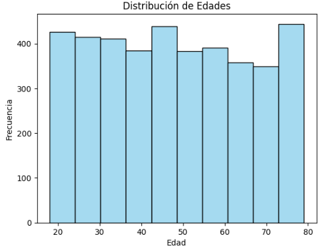

### Age Distribution by Plan
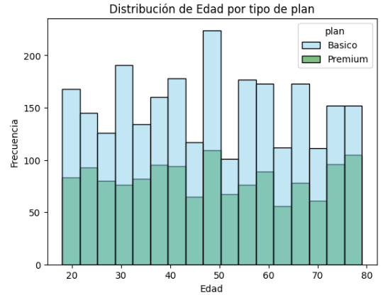

### Messages Distribution by Plan
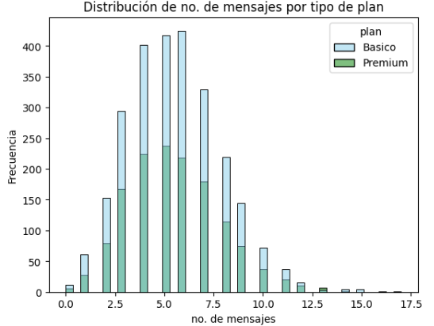

### Calls Distribution by Plan
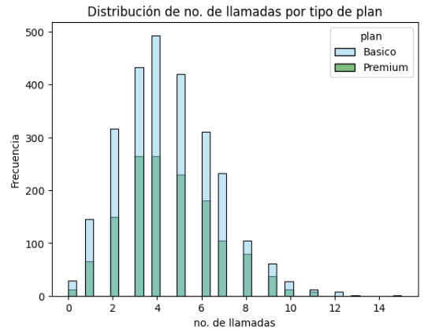

### Total Call Minutes by Plan
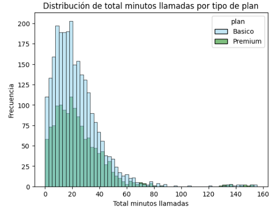

### Outlier Detection — Age
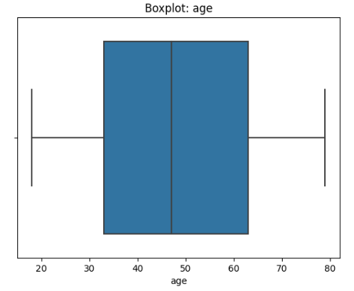

### Outlier Detection — Messages
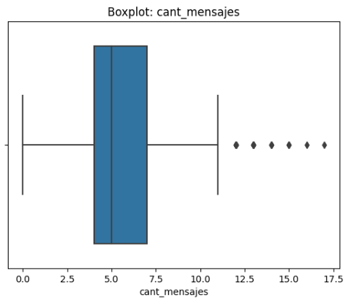

### Outlier Detection — Calls
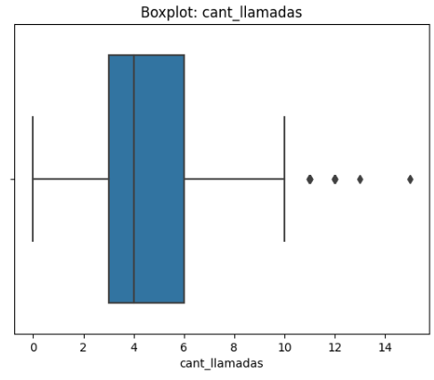

### Outlier Detection — Call Minutes
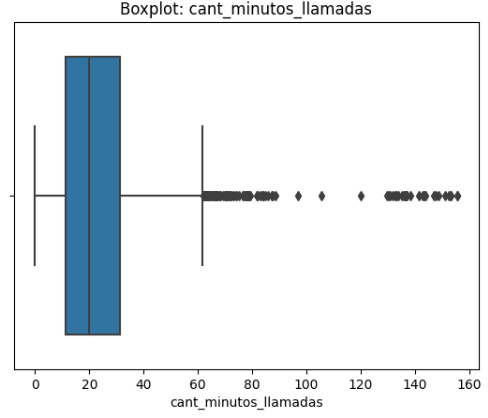

### Customer Segmentation — Usage Group
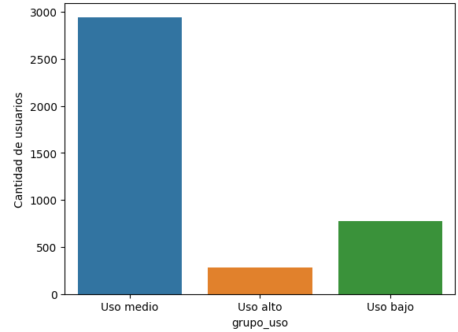

### Customer Segmentation — Age Group
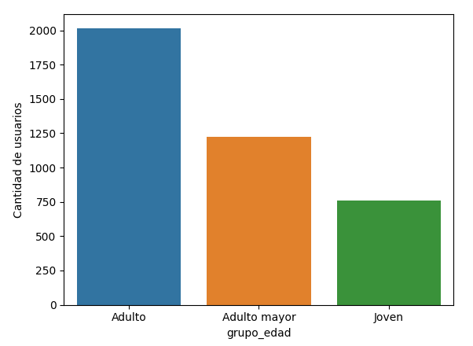

### Customer Segmentation — Usage × Age
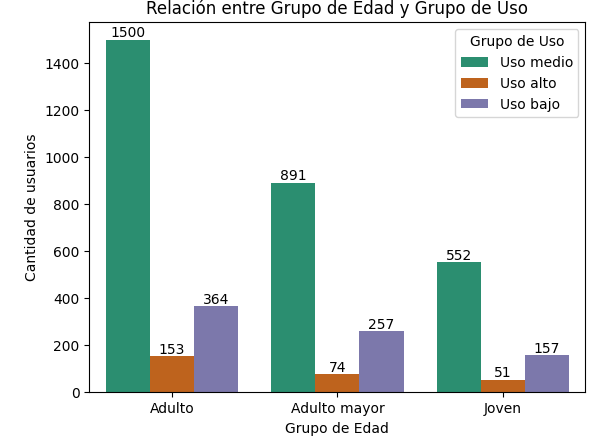

---

## Key Insights (C→F→I)
> Each insight follows the **Cause → Finding → Impact/Action** chain —
> not a list of isolated observations, but a narrative connecting
> data with business decisions.

### Insight 1: Plan Choice Is Not Driven by Age
- **Cause:** ConnectaTel's plan design (Basico vs. Premium) does not currently differentiate value propositions by customer age.
- **Finding:** The age distribution is nearly symmetric and comparable across both plans, with a median age of ~47 years for both Basico and Premium subscribers, even though Basico still holds 64.9% of the customer base.
- **Impact / Recommended Action:** Since age alone does not drive plan choice, upsell campaigns should target consumption thresholds rather than demographic segments.

### Insight 2: A Small Cohort Drives Disproportionate Usage
- **Cause:** A minority of customers consume messaging and calling services far above the typical user, while most usage metrics remain modest (median call time ≈ 19.8 minutes).
- **Finding:** Boxplot analysis confirmed right-skewed distributions for messages, calls, and call minutes, with legitimate high-usage outliers reaching up to 155.7 total call minutes — retained after verifying they were not sentinel or capture errors.
- **Impact / Recommended Action:** This high-usage cohort represents ConnectaTel's strongest Premium upsell and retention candidates; a dedicated "heavy user" rewards tier could increase revenue per user and reduce churn risk.

### Insight 3: Adult, Medium-Usage Customers Are the Core Revenue Base
- **Cause:** The customer base skews toward middle-aged adults (30–59 years old represent 50.4% of users, 2,017 of 3,999), and this group predominantly falls into the medium-usage tier.
- **Finding:** The Adulto + Uso medio combination is the single largest cohort in the segmentation matrix, forming the bulk of the 2,943 medium-usage users.
- **Impact / Recommended Action:** Retention and referral campaigns should prioritize this segment first, since it represents the highest-volume and most stable share of ConnectaTel's active customer base.

---

## Business Recommendations
- Launch a referral/loyalty program targeted at the Adulto + Uso medio segment to protect the core revenue base and encourage organic growth.
- Design a "heavy user" rewards tier for the Uso alto segment to increase retention and encourage migration toward Premium.
- Shift future plan design and promotions from age-based positioning toward consumption-based segmentation (Uso bajo / medio / alto), since age does not meaningfully differentiate current plan choice.

---

## How to Reproduce
1. Clone the repository.
2. Create a virtual environment and install dependencies:
```bash
   pip install -r requirements.txt
```
3. Open `proyecto-analysys-connectatel.ipynb` in Jupyter Notebook, VS Code, or Google Colab.
4. Confirm the `data/raw/` folder contains `plans.csv`, `users_latam.csv`, and `usage.csv`.
5. Run all cells sequentially to reproduce the cleaning, segmentation, and visualizations.

---

## Future Improvements
- Convert the sentinel-value detection and cleaning rules into reusable functions instead of manual, notebook-specific thresholds.
- Build a churn-prediction model leveraging the existing `churn_date` field once more labeled data is available.
- Develop an interactive Power BI or Tableau dashboard on top of the cleaned `user_profile` table for stakeholder self-service exploration.

---

## Lessons Learned
- Technical learnings: Sentinel values are not always `NaN`. This dataset required detecting `-999` (age) and out-of-range years (`2026` in `reg_date`) through descriptive statistics and range checks, not just `.isna()`.
- Business learnings: A MAR (Missing At Random) check confirmed that null values in `duration` and `length` are structurally explained by the `type` column (call vs. text) and were correctly left as nulls rather than imputed.
- Professional learnings: Recalculating each metric mathematically after every cleaning step (rather than trusting the first pass) prevented silently propagating a skewed statistic into the final segmentation.

---

## Author

**Jacobo Galindo Ortiz**
Data Analyst Portfolio

[](https://www.linkedin.com/in/jacobo-galindo-ortiz)
[](https://github.com/JacoboGO)
[](https://public.tableau.com/app/profile/jacobo.galindo.ortiz/vizzes)
[](mailto:jacobo.galindo.ortiz@hotmail.com)

---

> *"Language is a window into the mind."*
> — Noam Chomsky

<div align="center">

⭐ If this project was useful to you, consider leaving a star
on the repository — it helps a lot and is greatly appreciated.

</div>

---

## Usage Notice

This repository is provided for portfolio and educational review purposes.

The project may be viewed to evaluate the analytical approach,
methodology, and implementation. It is not intended for redistribution,
commercial use, or incorporation into other projects without prior
written permission from the author.

If you would like to reference or discuss any part of this work,
please contact the author.